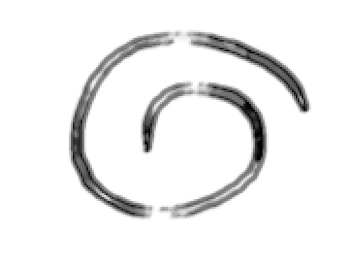

<div align="center">
  
</div>

### 修正パッチ配布

_※ 個人的パッチです。検討するかは各自の判断でお願いします。_

```markdown
# Folder PATH
cd .file/patch

# patch PATH
/mnt/c/Users/user/AppData/Local/nvim-data/mason/packages/solargraph/gems/rbs-4.0.3/lib/rbs/environment_loader.rb
/mnt/c/Users/user/AppData/Local/nvim-data/mason/packages/solargraph/gems/solargraph-0.60.1/lib/solargraph/library.rb

# パッチを生成 (./file/patch/origin)
diff -u /mnt/c/Users/user/AppData/Local/nvim-data/mason/packages/solargraph/gems/rbs-4.0.3/lib/rbs/environment_loader.rb environment_loader.rb > environment_loader.patch
diff -u /mnt/c/Users/user/AppData/Local/nvim-data/mason/packages/solargraph/gems/solargraph-0.60.1/lib/solargraph/library.rb library.rb > library.patch

# パッチを適用 (Windows)
patch -u /mnt/c/Users/user/AppData/Local/nvim-data/mason/packages/solargraph/gems/rbs-4.0.3/lib/rbs/environment_loader.rb < environment_loader.patch
patch -u /mnt/c/Users/user/AppData/Local/nvim-data/mason/packages/solargraph/gems/solargraph-0.60.1/lib/solargraph/library.rb < library.patch

# パッチを適用 (UNIX)
patch -u ~/.local/share/nvim/mason/packages/solargraph/gems/rbs-4.0.3/lib/rbs/environment_loader.rb < environment_loader.patch
patch -u ~/.local/share/nvim/mason/packages/solargraph/gems/solargraph-0.60.1/lib/solargraph/library.rb < library.patch

# パッチを元に戻す (Windows)
patch -u -R /mnt/c/Users/user/AppData/Local/nvim-data/mason/packages/solargraph/gems/rbs-4.0.3/lib/rbs/environment_loader.rb < environment_loader.patch
patch -u -R /mnt/c/Users/user/AppData/Local/nvim-data/mason/packages/solargraph/gems/solargraph-0.60.1/lib/solargraph/library.rb < library.patch

# パッチを元に戻す (UNIX)
patch -u -R ~/.local/share/nvim/mason/packages/solargraph/gems/rbs-4.0.3/lib/rbs/environment_loader.rb < environment_loader.patch
patch -u -R ~/.local/share/nvim/mason/packages/solargraph/gems/solargraph-0.60.1/lib/solargraph/library.rb < library.patch
```

> C:/Users/user/AppData/Local/nvim-data/lsp.log
>
> ~/.local/state/nvim/logs/lsp.log

- Windows環境、WSL2でenvironment_loader.patchを検証しました。(C:/Users/ユーザ名/)。✅️

- UNIX環境、Hyper-V上のUbuntu-24.04でenvironment_loader.patchを検証しました。✅️

- スレッドセーフと排他的制御にする[変更](https://github.com/takkii/.file/blob/main/patch/origin/library.rb#L482)をlibrary.patchにしました。✅️

  ※ library.patchはsolargraphを高速化しますが、lsp.log内を肥大化させます。

  必要に応じて、適用したパッチを元に戻しlsp.log内を全削除してください。

```markdown
# 例えば、lsp.logを複製するには。
cd ~/.local/state/nvim/logs/
mkdir backup
cp lsp.log ~/.local/state/nvim/logs/backup
```

※ _必要ならば、lsp.logの複製をbackupフォルダーに入れます。_

```markdown
# 例えば、lsp.logをクリアにするには。
cd ~/.local/state/nvim/logs/
rm -rf lsp.log
touch lsp.log
```

_※ lsp.log内を全削除することが前提です。_

更新履歴: 2026/06/24🔄
